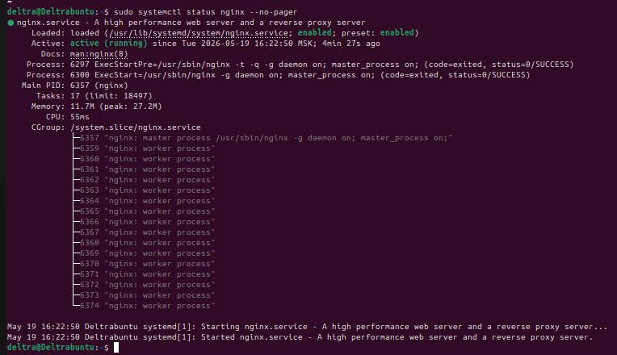
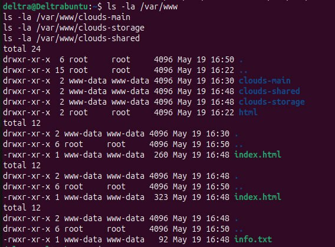
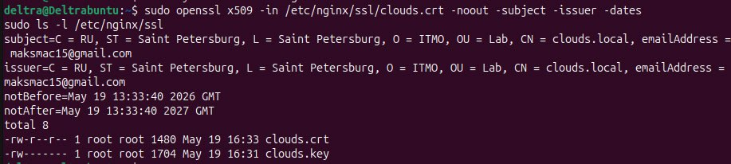
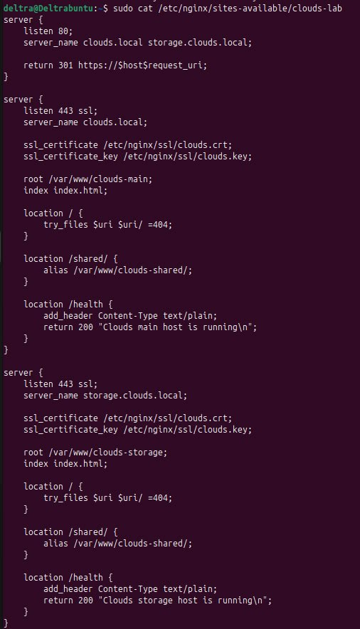
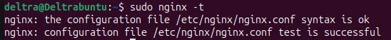
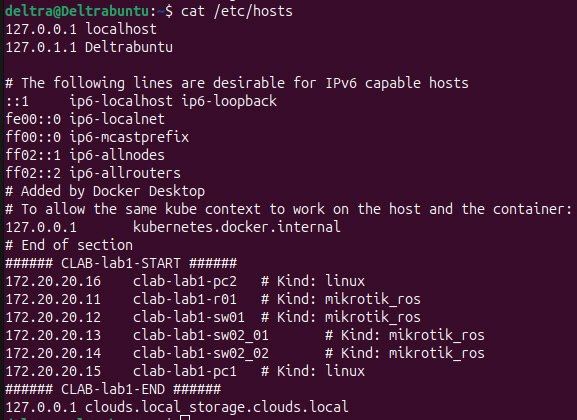
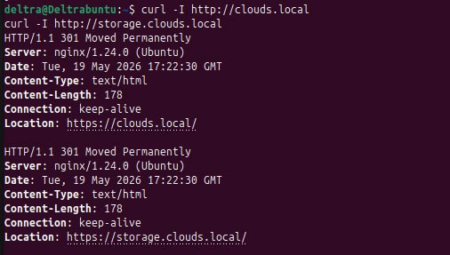
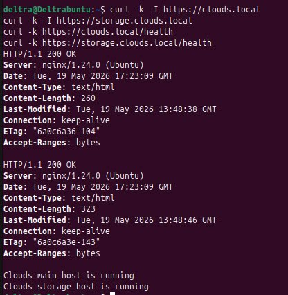
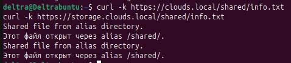
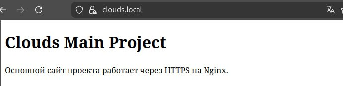

# Лабораторная работа №1. Настройка Nginx

## Цель работы

Цель работы — настроить веб-сервер Nginx для обслуживания двух веб-проектов на одном сервере. В рамках работы необходимо обеспечить доступ к сайтам по HTTPS, настроить автоматическое перенаправление с HTTP на HTTPS, использовать директиву `alias` для отдельного каталога с файлами и проверить работу виртуальных хостов.

## Задание

Необходимо настроить Nginx по следующим требованиям:

1. веб-сервер должен работать по HTTPS с сертификатом;
2. HTTP-запросы на порт 80 должны автоматически перенаправляться на HTTPS, порт 443;
3. должен использоваться `alias` для создания псевдонима пути к отдельному каталогу на сервере;
4. на одном сервере должны быть настроены виртуальные хосты для нескольких доменных имён;
5. дополнительно необходимо реализовать небольшой служебный маршрут для проверки работоспособности проекта.

## Исходные данные

В работе используется сервер с ОС Ubuntu и установленным Nginx. Для проверки были выбраны два локальных доменных имени:

| Домен | Назначение | Каталог проекта |
|---|---|---|
| `clouds.local` | основной сайт проекта | `/var/www/clouds-main` |
| `storage.clouds.local` | второй виртуальный хост | `/var/www/clouds-storage` |

Общий каталог с файлами, подключаемый через `alias`:

```text
/var/www/clouds-shared
```

Для локальной лабораторной работы используется самоподписанный SSL-сертификат. Браузер может показать предупреждение о том, что сертификат не выпущен доверенным центром сертификации. Для учебной работы это допустимо, так как проверяется сама настройка HTTPS.

## Ход выполнения

### 1. Установка и запуск Nginx

Сначала были обновлены списки пакетов и установлен веб-сервер Nginx:

```bash
sudo apt update
sudo apt install nginx -y
```

После установки служба была запущена и добавлена в автозагрузку:

```bash
sudo systemctl start nginx
sudo systemctl enable nginx
sudo systemctl status nginx
```

Для проверки можно открыть в браузере адрес сервера или выполнить команду:

```bash
curl -I http://localhost
```

**Скриншот 1 — установленный и запущенный Nginx:**



### 2. Создание каталогов для сайтов и общего хранилища

Далее были созданы каталоги для двух виртуальных хостов и отдельный каталог, который будет подключаться через `alias`:

```bash
sudo mkdir -p /var/www/clouds-main
sudo mkdir -p /var/www/clouds-storage
sudo mkdir -p /var/www/clouds-shared
```

В каждый каталог были добавлены тестовые HTML-страницы и файл для проверки псевдонима пути:

```bash
cat <<'HTML' | sudo tee /var/www/clouds-main/index.html
<!DOCTYPE html>
<html lang="ru">
<head>
    <meta charset="UTF-8">
    <title>Clouds Main</title>
</head>
<body>
    <h1>Clouds Main</h1>
    <p>Это основной виртуальный хост clouds.local.</p>
    <p><a href="/shared/info.txt">Проверка alias: общий файл</a></p>
</body>
</html>
HTML

cat <<'HTML' | sudo tee /var/www/clouds-storage/index.html
<!DOCTYPE html>
<html lang="ru">
<head>
    <meta charset="UTF-8">
    <title>Clouds Storage</title>
</head>
<body>
    <h1>Clouds Storage</h1>
    <p>Это второй виртуальный хост storage.clouds.local.</p>
    <p><a href="/shared/info.txt">Проверка alias: общий файл</a></p>
</body>
</html>
HTML

echo "Файл открыт через alias /shared/." | sudo tee /var/www/clouds-shared/info.txt
```

После этого были назначены права доступа для Nginx:

```bash
sudo chown -R www-data:www-data /var/www/clouds-main
sudo chown -R www-data:www-data /var/www/clouds-storage
sudo chown -R www-data:www-data /var/www/clouds-shared
sudo chmod -R 755 /var/www/clouds-main /var/www/clouds-storage /var/www/clouds-shared
```

Проверка структуры каталогов:

```bash
ls -la /var/www
ls -la /var/www/clouds-main
ls -la /var/www/clouds-storage
ls -la /var/www/clouds-shared
```

**Скриншот 2 — созданные каталоги и тестовые файлы:**



### 3. Создание самоподписанного SSL-сертификата

Для работы HTTPS был создан каталог для сертификатов:

```bash
sudo mkdir -p /etc/nginx/ssl
```

Затем был подготовлен конфигурационный файл OpenSSL. В нём указаны оба локальных доменных имени, чтобы один сертификат подходил сразу для двух виртуальных хостов:

```bash
cat <<'OPENSSL_CONFIG' | sudo tee /etc/nginx/ssl/clouds-openssl.cnf
[req]
default_bits = 2048
prompt = no
default_md = sha256
x509_extensions = v3_req
distinguished_name = dn

[dn]
C = RU
ST = Saint Petersburg
L = Saint Petersburg
O = ITMO Lab
OU = Nginx Lab
CN = clouds.local

[v3_req]
subjectAltName = @alt_names

[alt_names]
DNS.1 = clouds.local
DNS.2 = storage.clouds.local
OPENSSL_CONFIG
```

После этого был сгенерирован самоподписанный сертификат и приватный ключ:

```bash
sudo openssl req -x509 -nodes -days 365 -newkey rsa:2048 \
  -keyout /etc/nginx/ssl/clouds.key \
  -out /etc/nginx/ssl/clouds.crt \
  -config /etc/nginx/ssl/clouds-openssl.cnf
```

Права на приватный ключ были ограничены:

```bash
sudo chmod 600 /etc/nginx/ssl/clouds.key
```

Проверка сертификата:

```bash
sudo openssl x509 -in /etc/nginx/ssl/clouds.crt -noout -subject -issuer -dates
sudo ls -l /etc/nginx/ssl
```

**Скриншот 3 — созданный SSL-сертификат:**



### 4. Настройка виртуальных хостов Nginx

Для двух сайтов был создан общий конфигурационный файл:

```bash
sudo nano /etc/nginx/sites-available/clouds-lab
```

Содержимое файла:

```nginx
server {
    listen 80;
    server_name clouds.local storage.clouds.local;

    return 301 https://$host$request_uri;
}

server {
    listen 443 ssl;
    server_name clouds.local;

    ssl_certificate /etc/nginx/ssl/clouds.crt;
    ssl_certificate_key /etc/nginx/ssl/clouds.key;

    root /var/www/clouds-main;
    index index.html;

    location / {
        try_files $uri $uri/ =404;
    }

    location /shared/ {
        alias /var/www/clouds-shared/;
        autoindex on;
    }

    location = /health {
        default_type text/plain;
        return 200 "clouds.local is working\n";
    }
}

server {
    listen 443 ssl;
    server_name storage.clouds.local;

    ssl_certificate /etc/nginx/ssl/clouds.crt;
    ssl_certificate_key /etc/nginx/ssl/clouds.key;

    root /var/www/clouds-storage;
    index index.html;

    location / {
        try_files $uri $uri/ =404;
    }

    location /shared/ {
        alias /var/www/clouds-shared/;
        autoindex on;
    }

    location = /health {
        default_type text/plain;
        return 200 "storage.clouds.local is working\n";
    }
}
```

В данной конфигурации первый блок `server` принимает HTTP-запросы на порт 80 и перенаправляет их на HTTPS. Второй и третий блоки обслуживают два разных доменных имени на одном сервере. Для каждого HTTPS-хоста указан один и тот же SSL-сертификат, так как он содержит оба домена. Директива `alias` используется в маршруте `/shared/` и открывает доступ к отдельному каталогу `/var/www/clouds-shared/`, который не является корневым каталогом сайтов.

**Скриншот 4 — конфигурация виртуальных хостов Nginx:**



### 5. Активация конфигурации

Стандартный сайт Nginx был отключён, чтобы он не мешал проверке виртуальных хостов:

```bash
sudo rm -f /etc/nginx/sites-enabled/default
```

Затем была создана символическая ссылка на новый конфигурационный файл:

```bash
sudo ln -s /etc/nginx/sites-available/clouds-lab /etc/nginx/sites-enabled/clouds-lab
```

Перед перезапуском была выполнена проверка синтаксиса конфигурации:

```bash
sudo nginx -t
```

Если проверка прошла успешно, Nginx можно перезапустить:

```bash
sudo systemctl reload nginx
```

**Скриншот 5 — успешная проверка `nginx -t`:**



### 6. Настройка локальных доменных имён

Чтобы локальные доменные имена открывались на этом сервере, они были добавлены в файл `hosts`.

Если проверка выполняется на той же Ubuntu-машине, достаточно добавить строку в `/etc/hosts`:

```bash
sudo nano /etc/hosts
```

Строка для добавления:

```text
127.0.0.1 clouds.local storage.clouds.local
```

Если Nginx запущен на виртуальной машине, а браузер открывается на Windows, нужно сначала узнать IP-адрес Ubuntu:

```bash
hostname -I
```

После этого на Windows нужно открыть файл от имени администратора:

```text
C:\Windows\System32\drivers\etc\hosts
```

И добавить строку такого вида:

```text
IP_АДРЕС_UBUNTU clouds.local storage.clouds.local
```

**Скриншот 6 — запись доменов в hosts:**



### 7. Проверка перенаправления HTTP на HTTPS

Для проверки автоматического перенаправления был выполнен запрос к HTTP-версии сайта:

```bash
curl -I http://clouds.local
```

Ожидаемый результат — код ответа `301 Moved Permanently` и заголовок `Location`, ведущий на HTTPS-версию сайта:

```text
HTTP/1.1 301 Moved Permanently
Location: https://clouds.local/
```

Дополнительно можно проверить второй домен:

```bash
curl -I http://storage.clouds.local
```

**Скриншот 7 — перенаправление с HTTP на HTTPS:**



### 8. Проверка HTTPS и виртуальных хостов

Так как сертификат самоподписанный, для проверки через `curl` используется ключ `-k`:

```bash
curl -k -I https://clouds.local
curl -k -I https://storage.clouds.local
```

Для проверки служебного маршрута были выполнены команды:

```bash
curl -k https://clouds.local/health
curl -k https://storage.clouds.local/health
```

Ожидаемый результат:

```text
clouds.local is working
storage.clouds.local is working
```

**Скриншот 8 — проверка HTTPS и health-маршрута:**



### 9. Проверка работы alias

Для проверки директивы `alias` был открыт путь `/shared/info.txt`. Файл физически находится в каталоге `/var/www/clouds-shared/`, но доступен через URL внутри обоих виртуальных хостов:

```bash
curl -k https://clouds.local/shared/info.txt
curl -k https://storage.clouds.local/shared/info.txt
```

Ожидаемый результат:

```text
Файл открыт через alias /shared/.
```

**Скриншот 9 — проверка alias:**



### 10. Проверка в браузере

После настройки оба домена были открыты в браузере:

```text
https://clouds.local
https://storage.clouds.local
```

Для самоподписанного сертификата браузер может показать предупреждение. После перехода на сайт видно, что разные домены открывают разные страницы, хотя обслуживаются одним сервером Nginx.

**Скриншот 10 — основной виртуальный хост:**



**Скриншот 11 — второй виртуальный хост:**


## Итоговая проверка требований

| Требование | Реализация |
|---|---|
| HTTPS с сертификатом | создан самоподписанный сертификат `clouds.crt` и ключ `clouds.key` |
| Редирект HTTP на HTTPS | настроен `return 301 https://$host$request_uri;` для порта 80 |
| Использование `alias` | путь `/shared/` связан с каталогом `/var/www/clouds-shared/` |
| Несколько доменов на одном сервере | настроены `clouds.local` и `storage.clouds.local` |
| Дополнительное требование проекта | добавлен маршрут `/health` для проверки работоспособности |

## Вывод

В ходе лабораторной работы был настроен веб-сервер Nginx для обслуживания двух локальных доменных имён на одном сервере. Для сайтов был подключён HTTPS с самоподписанным сертификатом, настроено принудительное перенаправление с HTTP на HTTPS, а также реализован доступ к общему каталогу через директиву `alias`. Проверка через `curl` и браузер показала, что оба виртуальных хоста работают независимо и открывают разные страницы.
