# Лабораторная работа №2

## Тема

Анализ плохих практик при написании Dockerfile и работе с контейнерами. Исправление Dockerfile и Docker Compose конфигурации.

## Цель работы

Целью работы является изучение типичных ошибок при создании Docker-образов и настройке контейнеров, а также разработка исправленного варианта Dockerfile и Docker Compose файла.

В рамках работы были подготовлены:

- плохой Dockerfile с намеренно допущенными ошибками;
- хороший Dockerfile, где эти ошибки исправлены;
- плохой Docker Compose файл;
- хороший Docker Compose файл с изоляцией сервисов по сетям;
- описание плохих практик и объяснение исправлений.

---

## 1. Структура проекта

Для лабораторной работы был создан небольшой тестовый проект на Python. Приложение запускает простой HTTP-сервер и отдаёт страницу с названием сервиса.

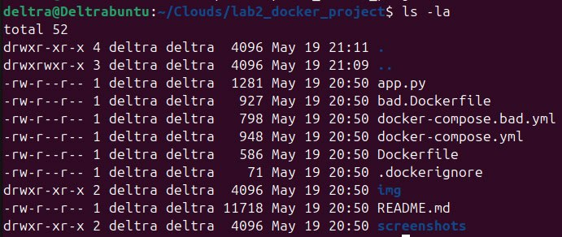

В проект входят следующие основные файлы:

| Файл | Назначение |
|---|---|
| `app.py` | Простое тестовое веб-приложение |
| `bad.Dockerfile` | Dockerfile с плохими практиками |
| `Dockerfile` | Исправленный Dockerfile |
| `.dockerignore` | Исключение лишних файлов из контекста сборки |
| `docker-compose.bad.yml` | Плохой Docker Compose файл |
| `docker-compose.yml` | Исправленный Docker Compose файл |

---

## 2. Плохой Dockerfile

Ниже представлен плохой Dockerfile, в котором намеренно допущены ошибки.

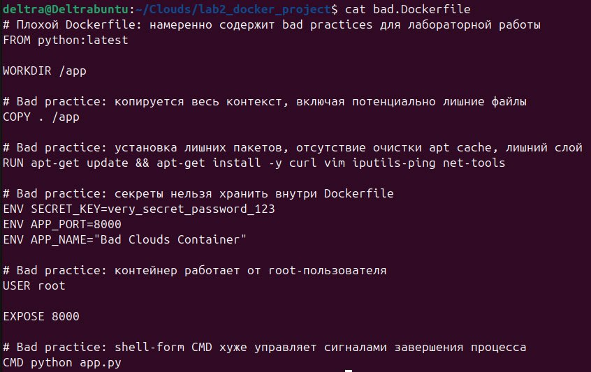

```dockerfile
FROM python:latest

WORKDIR /app
COPY . /app
RUN apt-get update && apt-get install -y curl vim iputils-ping net-tools
ENV SECRET_KEY=very_secret_password_123
ENV APP_PORT=8000
ENV APP_NAME="Bad Clouds Container"
USER root
EXPOSE 8000
CMD python app.py
```

В этом файле присутствуют следующие плохие практики:

1. Использование образа `python:latest`.
2. Копирование всего контекста сборки через `COPY . /app`.
3. Установка лишних пакетов без очистки кэша пакетного менеджера.
4. Хранение секрета через `ENV SECRET_KEY`.
5. Запуск контейнера от пользователя `root`.
6. Использование shell-form команды `CMD python app.py`.

---

## 3. Хороший Dockerfile

Исправленный Dockerfile выглядит следующим образом.

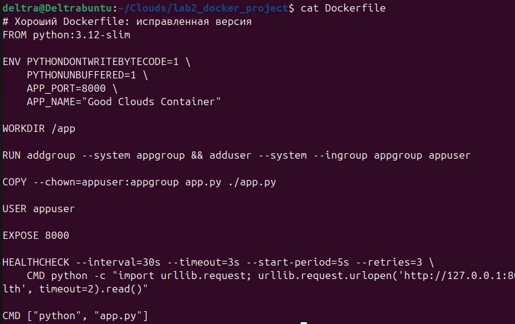

```dockerfile
FROM python:3.12-slim

ENV PYTHONDONTWRITEBYTECODE=1 \
    PYTHONUNBUFFERED=1 \
    APP_PORT=8000 \
    APP_NAME="Good Clouds Container"

WORKDIR /app

RUN addgroup --system appgroup && adduser --system --ingroup appgroup appuser

COPY --chown=appuser:appgroup app.py ./app.py

USER appuser

EXPOSE 8000

HEALTHCHECK --interval=30s --timeout=3s --start-period=5s --retries=3 \
    CMD python -c "import urllib.request; urllib.request.urlopen('http://127.0.0.1:8000/health', timeout=2).read()"

CMD ["python", "app.py"]
```

В хорошей версии были внесены следующие исправления:

- вместо `latest` используется конкретная версия `python:3.12-slim`;
- приложение запускается не от root, а от отдельного пользователя `appuser`;
- копируется только нужный файл приложения;
- для копируемого файла сразу задаётся владелец через `--chown`;
- не хранятся секреты внутри Dockerfile;
- добавлен `HEALTHCHECK`;
- команда запуска записана в exec-form: `CMD ["python", "app.py"]`.

---

## 4. Сравнение плохих практик и исправлений

| № | Плохая практика | Почему это плохо | Как исправлено |
|---|---|---|---|
| 1 | `FROM python:latest` | Версия образа может измениться, из-за чего сборка станет непредсказуемой | Использован `python:3.12-slim` |
| 2 | `COPY . /app` | В образ могут попасть лишние файлы, временные файлы, `.git`, `.env` | Добавлен `.dockerignore`, копируется только `app.py` |
| 3 | Установка лишних пакетов | Образ становится больше, а поверхность атаки шире | В хорошем Dockerfile лишние пакеты не устанавливаются |
| 4 | `ENV SECRET_KEY=...` | Секрет попадает в историю образа и может быть извлечён | Секреты не записываются в Dockerfile |
| 5 | `USER root` | При уязвимости приложения злоумышленник получит больше прав внутри контейнера | Создан отдельный пользователь `appuser` |
| 6 | `CMD python app.py` | Shell-form хуже обрабатывает сигналы завершения | Использован exec-form `CMD ["python", "app.py"]` |

---

## 5. Проверка сборки плохого и хорошего Dockerfile

Сначала был собран образ по плохому Dockerfile.

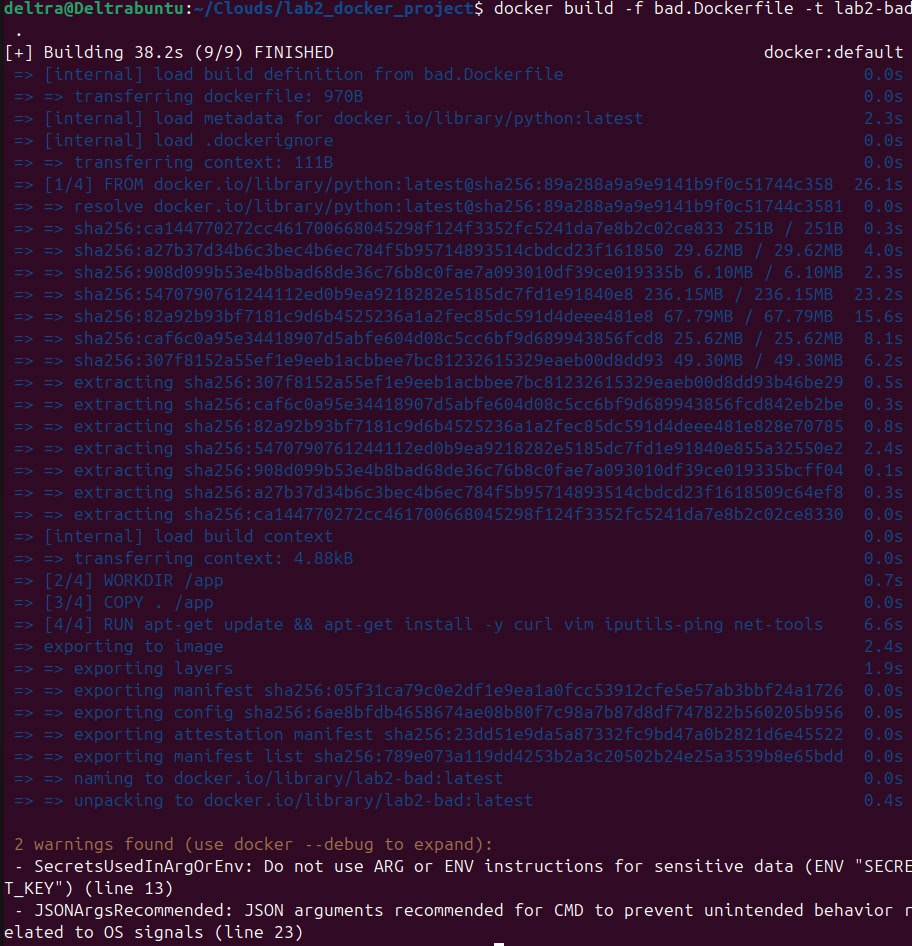

Затем был собран исправленный образ.

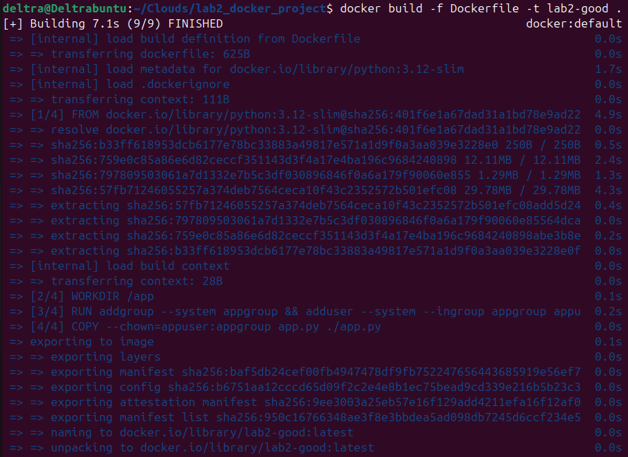

После запуска хорошего контейнера приложение стало доступно на локальном порту `8080`.

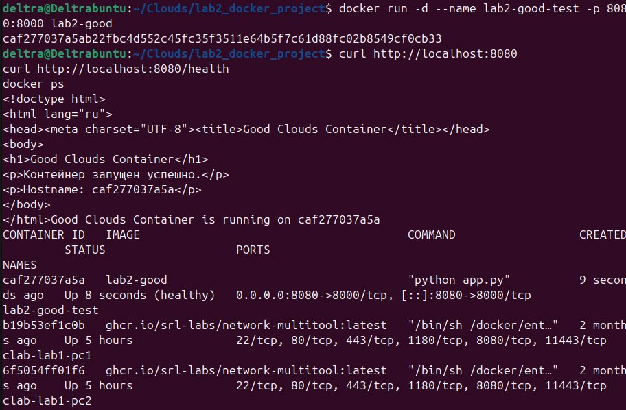

---

## 6. Плохие практики при работе с контейнерами

Кроме ошибок в Dockerfile, проблемы могут возникнуть и на этапе запуска контейнеров. В работе были рассмотрены две плохие практики.

### 6.1. Запуск контейнера с повышенными привилегиями

В плохом Compose-файле используется параметр:

```yaml
privileged: true
```

Это плохая практика, потому что контейнер получает расширенные права и становится менее изолированным от хостовой системы. Такой подход допустим только в редких случаях, когда контейнеру действительно нужен доступ к системным возможностям.

В хорошем Compose-файле вместо этого используется ограничение возможностей:

```yaml
cap_drop:
  - ALL
security_opt:
  - no-new-privileges:true
```

Это снижает риск повышения привилегий внутри контейнера.

### 6.2. Размещение всех контейнеров в одной общей сети

В плохом Compose-файле оба сервиса подключены к одной сети:

```yaml
networks:
  - shared_net
```

Из-за этого контейнеры могут видеть друг друга по DNS-именам и обмениваться трафиком без необходимости. Если сервисам не нужно взаимодействовать, их лучше разделять по разным сетям.

---

## 7. Плохой Docker Compose файл

Плохой Compose-файл содержит сразу несколько проблем: контейнеры работают от root, используют `privileged: true`, содержат секрет в переменных окружения и подключены к общей сети.

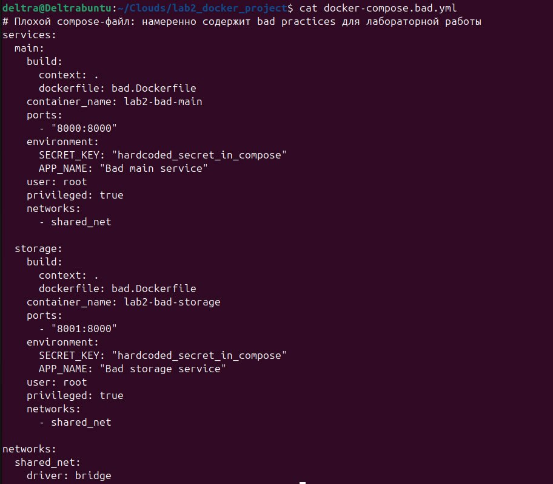

---

## 8. Хороший Docker Compose файл

В хорошем Compose-файле сервисы запускаются вместе, но помещены в разные сети:

- `main` находится в сети `main_net`;
- `storage` находится в сети `storage_net`.

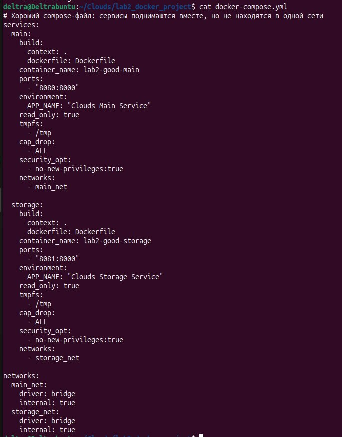

Такой подход позволяет запускать сервисы в рамках одного Compose-проекта, но при этом не давать им видеть друг друга по сети, если между ними нет такой необходимости.

---

## 9. Проверка запуска Compose-проекта

После запуска исправленного Compose-файла оба контейнера были успешно созданы.

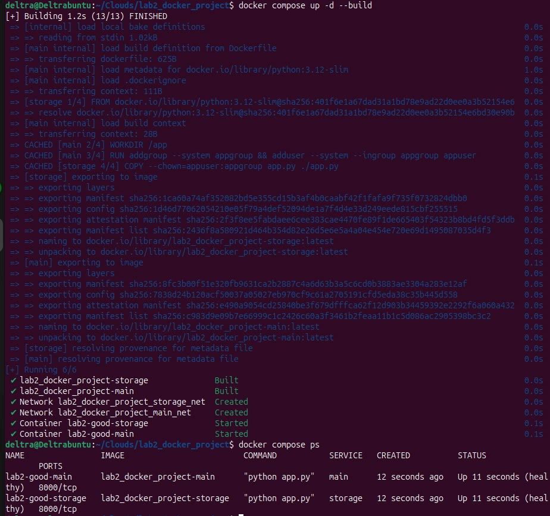

Проверка доступности сервисов с хоста:

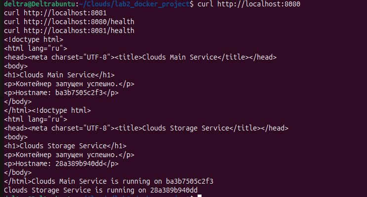

---

## 10. Проверка сетевой изоляции

Для проверки сетевой изоляции была выполнена попытка определить адрес контейнера `storage` из контейнера `main`.

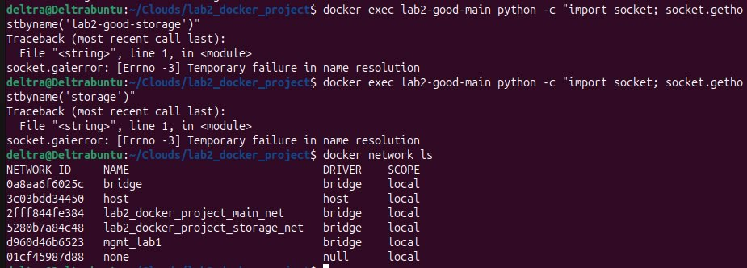

Так как контейнеры находятся в разных сетях, сервис `main` не может обратиться к `storage` по имени. Это подтверждает, что контейнеры поднимаются вместе в рамках одного Compose-проекта, но не видят друг друга на сетевом уровне.

---

## Вывод

В ходе лабораторной работы были рассмотрены плохие практики при создании Dockerfile и запуске контейнеров. Был подготовлен плохой Dockerfile, содержащий несколько типичных ошибок, и хороший Dockerfile, где эти ошибки исправлены. Также были рассмотрены ошибки в Docker Compose: запуск контейнеров с повышенными привилегиями и размещение независимых сервисов в общей сети.

Исправленный Compose-файл показывает, что сервисы могут запускаться вместе, но при этом быть изолированы друг от друга с помощью разных Docker-сетей. Это делает конфигурацию более безопасной и предсказуемой.
