# Лабораторная №3 — CI/CD и работа с секретами

## Задание

Цель работы — сравнить плохой и хороший подход к написанию CI/CD-пайплайна, а также показать более безопасный способ работы с секретами через отдельное хранилище секретов.

В рамках работы подготовлены:

1. “Плохой” CI/CD-файл, который работает, но содержит не менее пяти плохих практик.
2. “Хороший” CI/CD-файл, в котором эти плохие практики исправлены.
3. Описание каждой плохой практики, объяснение исправления и влияния исправления на результат.
4. Краткое обобщение, почему CI/CD должен быть воспроизводимым и осознанно настроенным.
5. Дополнительный пример со звёздочкой: получение секрета из HashiCorp Vault.

## Структура проекта

```text
lab3_ci_cd_project/
├── README.md
├── screenshot_guide.md
├── app.py
├── Dockerfile
├── requirements.txt
├── .dockerignore
├── .github/
│   └── workflows/
│       ├── bad-ci.yml
│       ├── good-ci.yml
│       └── vault-ci.yml
├── tests/
│   └── test_app.py
├── vault/
│   ├── docker-compose.yml
│   └── seed_and_read_demo.sh
└── img/
```

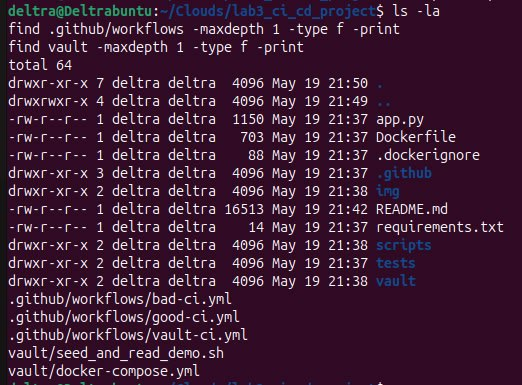

## Плохой CI/CD-файл

Плохой pipeline находится в файле:

```text
.github/workflows/bad-ci.yml
```

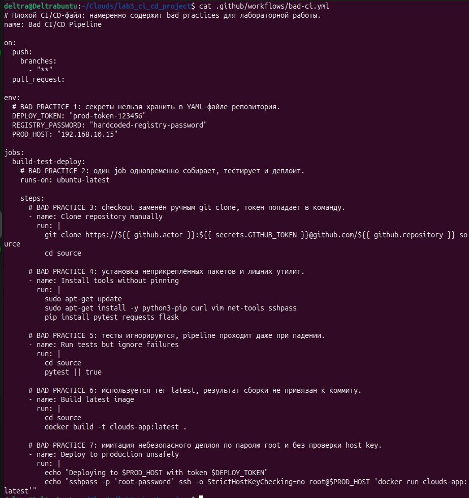

Этот файл намеренно сделан небезопасным и неаккуратным. Он выполняет сборку, запуск тестов и условный деплой, но содержит набор типичных ошибок.

### Плохая практика 1 — секреты захардкожены в YAML

В плохом файле токены и пароли записаны прямо в блоке `env`:

```yaml
DEPLOY_TOKEN: "prod-token-123456"
REGISTRY_PASSWORD: "hardcoded-registry-password"
```

Это плохая практика, потому что YAML-файл хранится в репозитории. Любой человек с доступом к коду увидит секрет. Если репозиторий случайно станет публичным или токен попадёт в историю Git, его придётся срочно отзывать.

В хорошем варианте секреты не хранятся в коде. Для стандартного CI/CD используется механизм секретов платформы, а в версии со звёздочкой показано получение секрета из HashiCorp Vault.

### Плохая практика 2 — запуск на всех ветках без ограничений

Плохой pipeline запускается на push в любую ветку:

```yaml
branches:
  - "**"
```

Это опасно, потому что деплой может случайно запуститься из экспериментальной ветки. Особенно плохо, если в этом же job находится production-деплой.

В хорошем варианте pipeline запускается только для `main` и pull request в `main`. Деплой дополнительно ограничен условием:

```yaml
if: github.event_name == 'push' && github.ref == 'refs/heads/main'
```

### Плохая практика 3 — сборка, тестирование и деплой смешаны в одном job

В плохом варианте всё лежит в одном job `build-test-deploy`. Если тесты, сборка и деплой находятся в одном большом блоке, pipeline становится сложнее отлаживать. Также труднее настроить разные права, разные условия запуска и ручное подтверждение production-деплоя.

В хорошем варианте логика разделена на три job:

```text
test → build → deploy
```

Это делает процесс понятнее. Деплой не начнётся, пока тесты и сборка не прошли успешно.

### Плохая практика 4 — ошибки тестов игнорируются

В плохом pipeline используется команда:

```bash
pytest || true
```

Она делает так, что даже при падении тестов job завершится успешно. В результате сломанный код может попасть в сборку или даже в production.

В хорошем варианте тесты запускаются обычной командой:

```bash
python -m pytest -q
```

Если тесты падают, pipeline останавливается.

### Плохая практика 5 — зависимости и окружение не зафиксированы

В плохом варианте используется:

```yaml
runs-on: ubuntu-latest
pip install pytest requests flask
```

`ubuntu-latest` может измениться со временем, а пакеты ставятся без версий. Это делает сборку менее воспроизводимой: сегодня pipeline проходит, а через месяц может сломаться из-за обновлений.

В хорошем варианте используется более конкретный runner:

```yaml
runs-on: ubuntu-24.04
```

Версия Python указана явно, а зависимости берутся из `requirements.txt`.

### Плохая практика 6 — использование тега latest

В плохом pipeline образ собирается с тегом:

```bash
clouds-app:latest
```

Тег `latest` не показывает, из какого коммита собран образ. При откате или разборе инцидента трудно понять, какая версия была запущена.

В хорошем варианте используется тег по SHA коммита:

```bash
$IMAGE_NAME:${{ github.sha }}
```

Такой образ связан с конкретным состоянием репозитория.

### Плохая практика 7 — небезопасный деплой

В плохом pipeline показан деплой через root-пользователя, пароль и отключение проверки host key:

```bash
sshpass -p 'root-password' ssh -o StrictHostKeyChecking=no root@$PROD_HOST
```

Такой подход опасен: пароль может утечь, root-доступ слишком широк, а отключение проверки host key повышает риск подключения не к тому серверу.

В хорошем варианте деплой вынесен в отдельный job, ограничен веткой `main` и окружением `production`. В реальном проекте здесь можно добавить ручное подтверждение, ограниченные ключи доступа и аудит.

## Хороший CI/CD-файл

Исправленный pipeline находится в файле:

```text
.github/workflows/good-ci.yml
```

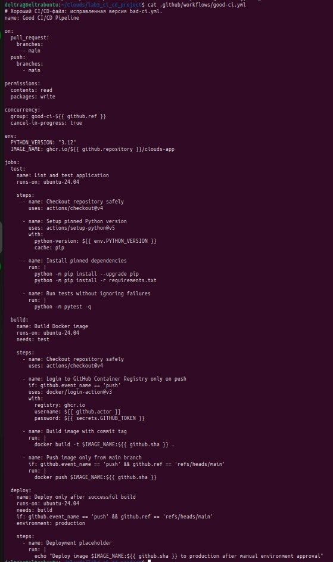

Основные исправления:

1. Используются ограниченные права через `permissions`.
2. Добавлен `concurrency`, чтобы новые запуски отменяли устаревшие.
3. Используется безопасный `actions/checkout@v4`.
4. Версии окружения и зависимостей зафиксированы.
5. Тесты не игнорируются.
6. Образ тегируется через SHA коммита.
7. Деплой отделён от тестов и сборки.
8. Production-деплой запускается только из `main`.

## CI/CD с HashiCorp Vault

Файл со звёздочкой находится здесь:

```text
.github/workflows/vault-ci.yml
```

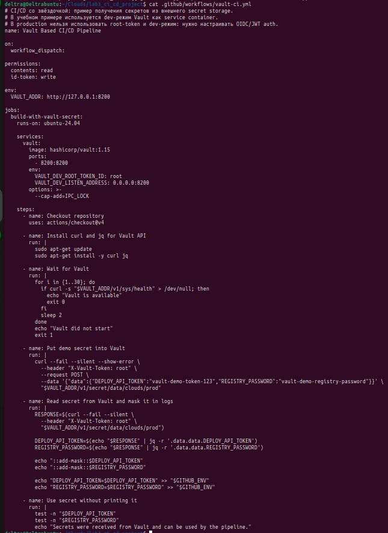

В этом примере HashiCorp Vault запускается как service container. Pipeline обращается к Vault через HTTP API, записывает демонстрационный секрет, затем читает его и маскирует в логах.

Принцип работы:

1. CI/CD запускает отдельный сервис Vault.
2. Pipeline обращается к API Vault.
3. Секрет извлекается во время выполнения job.
4. Значение маскируется через `::add-mask::`.
5. Секрет используется в job, но не хранится в YAML-файле.

В учебной версии используется dev-режим Vault и root token. Это сделано только для воспроизводимости лабораторной работы. В production так делать нельзя. В реальной инфраструктуре лучше использовать OIDC/JWT-аутентификацию CI/CD-платформы, короткоживущие токены, политики Vault и аудит обращений.

## Проверка локальных тестов

Для проверки приложения локально используются команды:

```bash
python3 -m venv .venv
source .venv/bin/activate
pip install -r requirements.txt
pytest -q
```

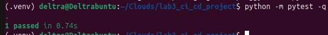

## Проверка Docker-сборки

```bash
docker build -t lab3-good-ci-app .
```

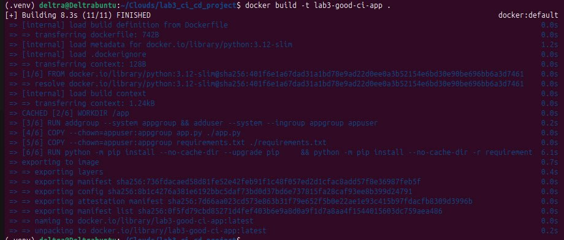

## Проверка контейнера

```bash
docker run -d --name lab3-app-test -p 8090:8000 lab3-good-ci-app
curl http://localhost:8090
curl http://localhost:8090/health
docker ps
```

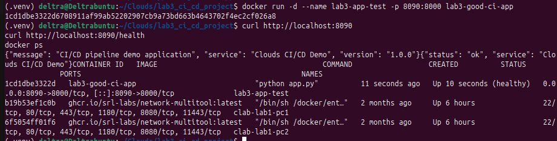

## Локальный запуск Vault

Для демонстрации Vault подготовлен файл:

```text
vault/docker-compose.yml
```

Запуск:

```bash
cd vault
docker compose up -d
docker compose ps
cd ..
```

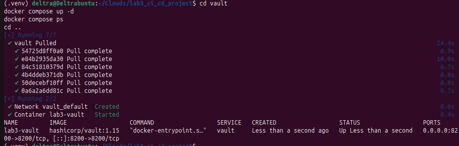

Проверка записи и чтения секрета:

```bash
bash vault/seed_and_read_demo.sh
```

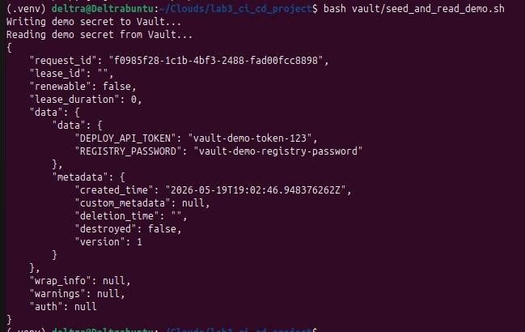

## Проверка bad practices через grep

```bash
grep -nE "DEPLOY_TOKEN|REGISTRY_PASSWORD|ubuntu-latest|pytest \|\| true|StrictHostKeyChecking=no|latest" .github/workflows/bad-ci.yml
```

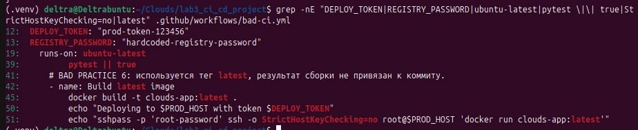

## Проверка исправлений через grep

```bash
grep -nE "permissions:|concurrency:|ubuntu-24.04|pytest -q|github.sha|environment: production|actions/checkout|setup-python" .github/workflows/good-ci.yml
```

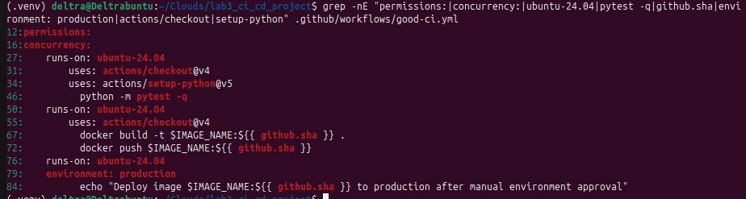

## Практический вывод по настройке CI/CD

CI/CD-пайплайн не должен быть набором команд, который просто “как-то работает”. Его задача — сделать процесс проверки, сборки и деплоя понятным, воспроизводимым и безопасным. Даже если pipeline успешно завершается, внутри него могут оставаться серьёзные проблемы: секреты в открытом виде, игнорирование тестов, запуск деплоя из любой ветки, использование непредсказуемых версий окружения и небезопасные команды подключения к серверу.

Хороший CI/CD строится по другому принципу: каждый этап выполняет отдельную задачу, права доступа ограничены, тесты действительно влияют на результат, сборка привязана к конкретному коммиту, а деплой запускается только из контролируемой ветки и через отдельное окружение. Такой подход уменьшает риск случайных ошибок и делает поведение pipeline более прозрачным.

Вариант со звёздочкой дополнительно показывает, что секреты лучше не хранить в YAML-файле и не привязывать только к настройкам репозитория. Отдельное хранилище секретов, например HashiCorp Vault, позволяет централизованно управлять доступом, выдавать секреты во время выполнения pipeline и не оставлять чувствительные данные в коде.

## Почему переменные репозитория не являются идеальным местом для секретов

Секреты CI/CD-платформы лучше, чем хранение паролей прямо в коде, но у них тоже есть ограничения:

1. Они привязаны к конкретной платформе и репозиторию.
2. Сложнее централизованно управлять доступом для нескольких проектов.
3. Не всегда удобно выдавать короткоживущие секреты.
4. Ротация секретов может стать ручной и неудобной.
5. Не всегда есть полноценный аудит того, какое приложение и когда запросило конкретный секрет.

HashiCorp Vault или аналогичное secret storage решает эти проблемы лучше. Оно позволяет хранить секреты централизованно, выдавать доступ по политикам, включать аудит, настраивать ротацию и выдавать временные учётные данные.

## Вывод

В ходе работы были подготовлены два варианта CI/CD. Плохой вариант показывает распространённые ошибки: секреты в коде, запуск на всех ветках, игнорирование тестов, смешивание всех этапов в одном job, использование `latest` и небезопасный деплой. Хороший вариант исправляет эти проблемы: этапы разделены, права ограничены, тесты обязательны, образ связан с SHA коммита, а деплой ограничен веткой `main` и окружением `production`.

Дополнительно был реализован пример работы с HashiCorp Vault. Он показывает, что секреты можно получать во время выполнения pipeline, не сохраняя их в CI/CD YAML-файле и не привязывая управление секретами только к настройкам репозитория.
